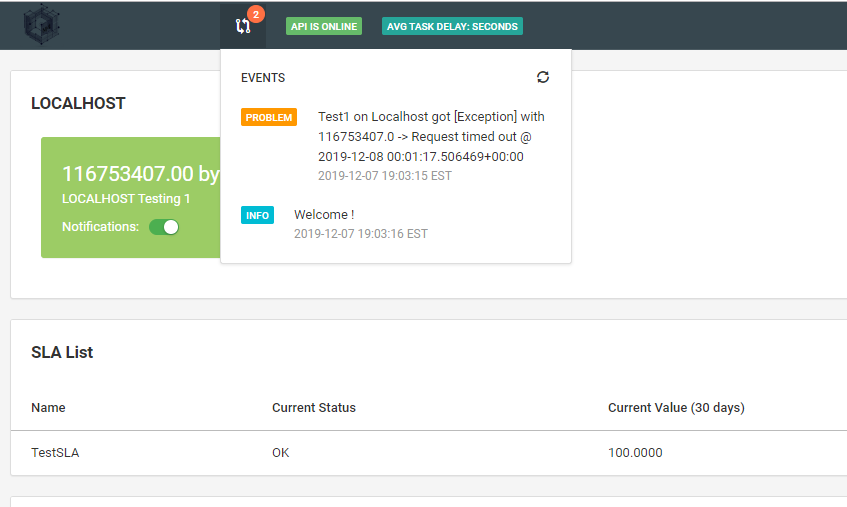
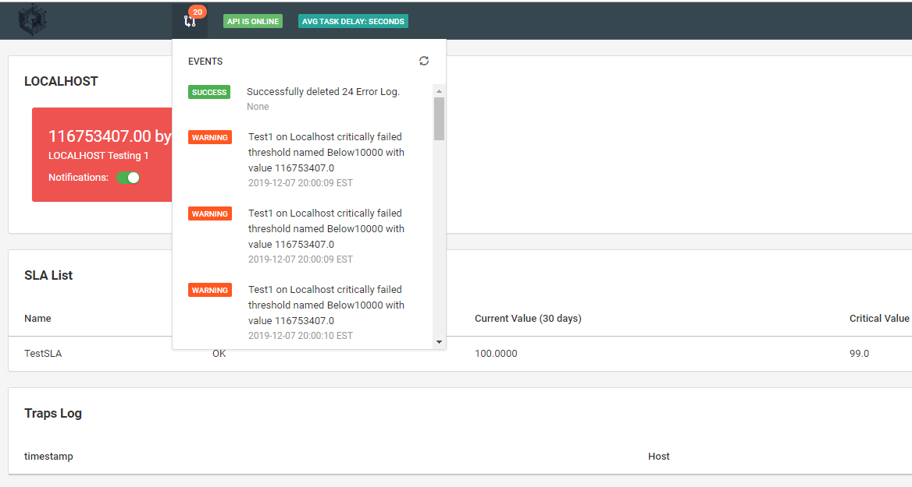
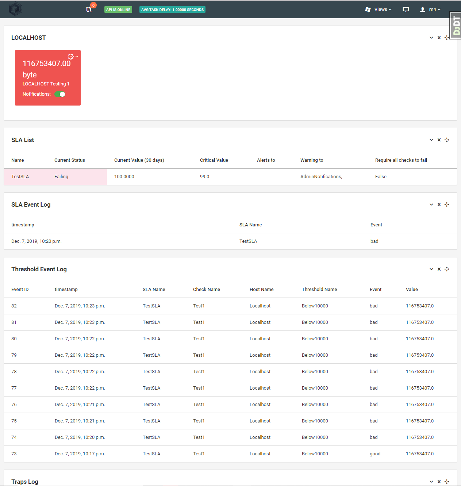
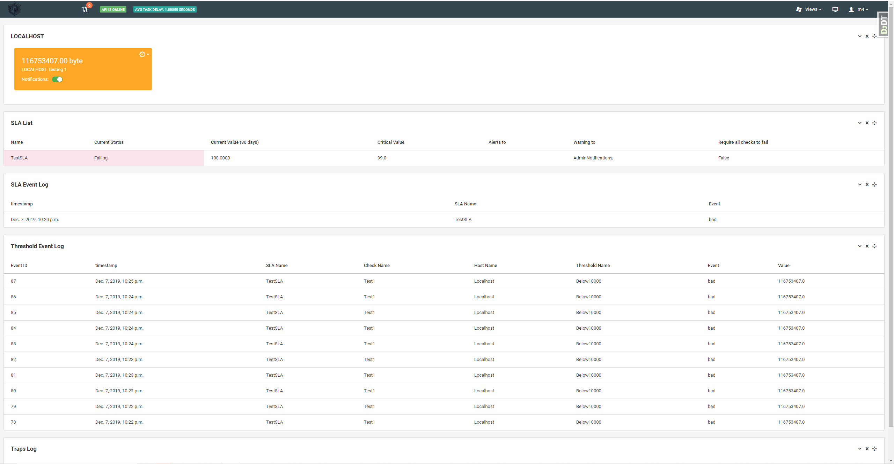
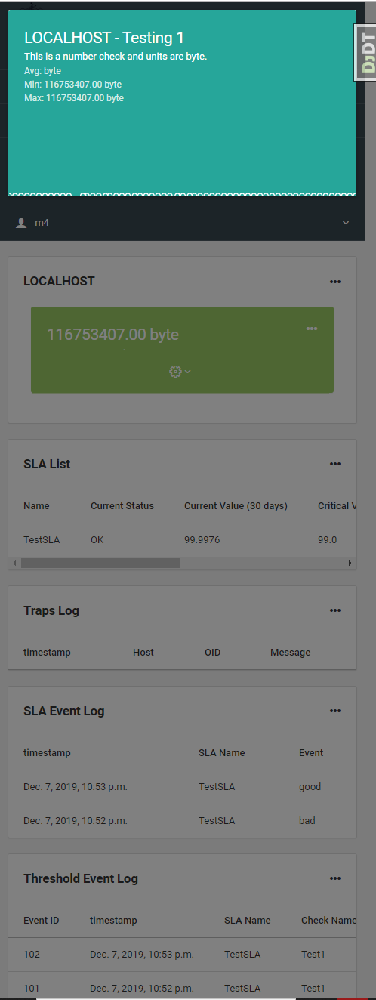
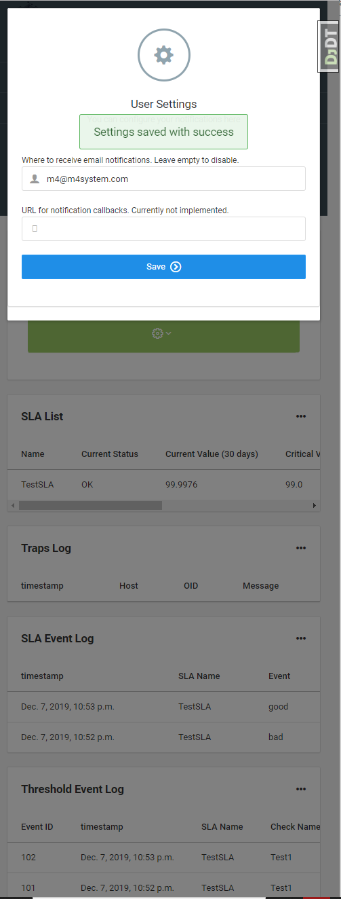

{}
Work in Progress.  Feel free to contribute with a [Pull Request](https://github.com/m4system/m4system.ca/pulls)!
{}

## The Screenshots

### Frontend notifications of polling errors

### Tiles are red when in critical status

### A Threshold fails a check which fails a SLA

### Can also be a warning, where we notify but are not yet in trouble.

### Mobile Friendly

### More mobile friendliness

### Comes with a backend Backend 

